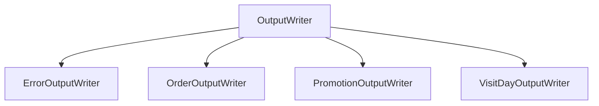

<div align="center">


</div>

---

## 🎄 92명의 리뷰어에게 전하는 프리코스 마지막 이야기

    12월 25일에 우테코 식당에서 받을 이벤트 혜택 미리 보기!
    
    <주문 메뉴>
    아이스크림 2개
    
    <할인 전 총주문 금액>
    10,000원
    
    <증정 메뉴>
    없음
    
    <혜택 내역>
    크리스마스 디데이 할인: -3,400원
    평일 할인: -4,046원
    특별 할인: -1,000원
    
    <총혜택 금액>
    -8,446원
    
    <할인 후 예상 결제 금액>
    1,554원
    
    <12월 이벤트 배지>
    별

▪️ 리뷰가 많아 로딩이 오래 걸립니다!
&nbsp;&nbsp;&nbsp;🦄 오류 발생시 새로고침 하거나 네트워크 상태를 확인해 주세요!!

- [\[우아한테크코스 프리코스 1주차\] 31명과 함께하는 224개의 이야기 (숫자 야구 게임)](https://github.com/woowacourse-precourse/java-baseball-6/pull/1613)
- [\[우아한테크코스 프리코스 2주차\] 39명과 함께하는 296개의 이야기 (자동차 경주 게임)](https://github.com/woowacourse-precourse/java-racingcar-6/pull/356)
- [\[우아한테크코스 프리코스 3주차\] 22명과 함께하는 213개의 이야기 (로또)](https://github.com/woowacourse-precourse/java-lotto-6/pull/449)

▪️ 프리코스를 열심히 완주한 당신! 이번 크리스마스 🎄 `우테코 식당`으로 모여주세요.
&nbsp;&nbsp;&nbsp;맛있는 `1,554원의 아이스크림`과 `별 배지`가 기다리고 있답니다.
▪️ 지난 3주 동안, 성장곡선을 [지수함수](https://terms.naver.com/entry.naver?docId=1144291&cid=40942&categoryId=32219)로 그릴 수 있도록 만들어 주신
92명의 크루 여러분들!
&nbsp;&nbsp;&nbsp;크리스마스에 우테코 식당에서 같이 아이스크림 먹어요! ~~(제가 사겠습니다)~~
▪️ 추신) `지수함수`의 정의역, 치역이 0인 지수함수라고 가정합니다.
&nbsp;&nbsp;&nbsp;(완전 가파르다는 뜻) 참고로 저는 `문과`입니다. ^____^!

<br>

## 📦&nbsp;&nbsp;패키지 구조

[//]: # (&nbsp;&nbsp;FinalResponse</b>)

<div align="center">
<table>
    <tr>
        <th align="center">Package</th>
        <th align="center">Class</th>
        <th align="center">Description</th>
    </tr>
    <tr>
        <td rowspan="3"><b>&nbsp;&nbsp;controller</b></td>
        <td><b>&nbsp;&nbsp;OrderController</b></td>
        <td>주문 목록 입력 요청 / 결과 출력</td>
    </tr>
    <tr>
        <td><b>&nbsp;&nbsp;PromotionController</b></td>
        <td>할인, 증정 등 <b>프로모션 혜택 결과 출력</b> 컨트롤러</td>
    </tr>
    <tr>
        <td><b>&nbsp;&nbsp;VisitDayController</b></td>
        <td><b>방문 일자 입력 요청 / 결과 출력 </b>컨트롤러</td>
    </tr>
    <tr>
        <td rowspan="5"><b>&nbsp;&nbsp;controller</b><br>➜&nbsp;&nbsp;dto</td>
        <td><b>&nbsp;&nbsp;BadgeResponse</b></td>
        <td><b>이벤트 배지</b> DTO</td>
    </tr>
    <tr>
        <td><b>&nbsp;&nbsp;DiscountResponse</b></td>
        <td><b>할인 프로모션 종류 및 가격, 총 할인 금액</b> DTO</td>
    </tr>
    <tr>
        <td><b>&nbsp;&nbsp;GiftResponse</b></td>
        <td><b>증정 프로모션 종류 및 갯수, 총 증정품 금액</b> DTO</td>
    </tr>
    <tr>
        <td><b>&nbsp;&nbsp;OrderResponse</b></td>
        <td><b>사용자의 주문 메뉴와 갯수</b>를 갖는 DTO</td>
    </tr>
    <tr>
        <td><b>&nbsp;&nbsp;VisitDayResponse</b></td>
        <td><b>방문월, 방문일</b> DTO</td>
    </tr>
    <tr><td colspan="3"></td></tr>
    <tr>
        <td rowspan="2">&nbsp;&nbsp;<b>domain<br></b>➜&nbsp;&nbsp;consumer</td>
        <td><b>&nbsp;&nbsp;Orders</b></td>
        <td><b>사용자의 주문 메뉴와 갯수</b>를 갖는 <b>일급 컬렉션</b> 클래스</td>
    </tr>
    <tr>
        <td><b>&nbsp;&nbsp;VisitDay</b></td>
        <td><b>사용자가 방문한 날짜</b>를 갖는 클래스</td>
    </tr>
    <tr>
        <td rowspan="3">&nbsp;&nbsp;<b>domain<br></b>➜&nbsp;&nbsp;constants</td>
        <td><b>&nbsp;&nbsp;Menu</b></td>
        <td><b>주문 가능 메뉴, 가격, 카테고리</b>를 갖는 열거형 클래스</td>
    </tr>
    <tr>
        <td><b>&nbsp;&nbsp;MenuCategory</b></td>
        <td><b>메뉴의 카테고리</b>를 갖는 열거형 클래스</td>
    </tr>
    <tr>
        <td><b>&nbsp;&nbsp;PlannerConstraint</b></td>
        <td>이벤트 진행에 필요한 <b>전역 설정</b>(Contraint)을 갖는 열거형 클래스</td>
    </tr>
    <tr><td colspan="3"></td></tr>
    <tr>
        <td rowspan="2">&nbsp;&nbsp;<b>domain<br></b>➜&nbsp;&nbsp;promotion<br>➜&nbsp;&nbsp;badge</td>
        <td><b>&nbsp;&nbsp;BadgeContext</b></td>
        <td>조건에 맞게 <b>배지를 생성</b>하는 전략 클래스</td>
    </tr>
    <tr>
        <td><b>&nbsp;&nbsp;BadgePromotion</b></td>
        <td><b>배지의 이름, 프로모션 적용 기간, 적용 조건</b>을 갖는 열거형 클래스</td>
    </tr>
    <tr>
        <td rowspan="3">&nbsp;&nbsp;<b>domain<br></b>➜&nbsp;&nbsp;promotion<br></b>➜&nbsp;&nbsp;discount</td>
        <td><b>&nbsp;&nbsp;AppliedDiscountPromotions</b></td>
        <td><b>조건에 맞게 적용된 할인 프로모션</b>을 갖는 <b>일급 컬렉션</b> 클래스</td>
    </tr>
    <tr>
        <td><b>&nbsp;&nbsp;DiscountContext</b></td>
        <td><b>적용 가능한 <b>할인 프로모션을</b>갖는 <b>일급 컬렉션</b> 전략 클래스</td>
    </tr>
    <tr>
        <td><b>&nbsp;&nbsp;DiscountPromotion</b></td>
        <td><b>할인 프로모션의 이름, 조건, 적용 기능</b>을 갖는 열거형 클래스</td>
    </tr>
    <tr>
        <td rowspan="3">&nbsp;&nbsp;<b>domain<br></b>➜&nbsp;&nbsp;promotion<br></b>➜&nbsp;&nbsp;gift</td>
        <td><b>&nbsp;&nbsp;AppliedGiftPromotions</b></td>
        <td><b>조건에 맞게 적용된 증정 프로모션</b>을 담는 <b>일급 컬렉션</b> 클래스</td>
    </tr>
    <tr>        
        <td><b>&nbsp;&nbsp;GiftContext</b></td>
        <td>적용 가능한 <b>증정 프로모션</b>을 갖는 <b>일급 컬렉션</b> 전략 클래스</td>
    </tr>
    <tr>        
        <td><b>&nbsp;&nbsp;GiftPromotion</b></td>
        <td><b>증정 프로모션의 이름, 조건, 갯수</b>를 갖는 열거형 클래스</td>
    </tr>
    <tr>
        <td rowspan="4">&nbsp;&nbsp;<b>domain<br></b>➜&nbsp;&nbsp;promotion<br></b>➜&nbsp;&nbsp;constants</td>
        <td><b>&nbsp;&nbsp;PromotionCondition</b></td>
        <td><b>프로모션의 적용 기간 및 조건, 필요한 배지 정보를</b> 갖는 열거형 클래스</td>
    </tr>
    <tr>
        <td><b>&nbsp;&nbsp;PromotionPeriod</b></td>
        <td><b>프로모션의 적용 기간에 대한 조건</b>을 상세히 갖는 열거형 클래스</td>
    </tr>
    <tr>
        <td><b>&nbsp;&nbsp;PromotionType</b></td>
        <td><b>상품의 종류</b>를 갖는 열거형 클래스</td>
    </tr>
    <tr>
        <td><b>&nbsp;&nbsp;SpecialPromotionPeriod</b></td>
        <td><b>특별 이벤트 적용 기간에 대한 조건</b>을 상세히 갖는 열거형 클래스</td>
    </tr>
    <tr><td colspan="3"></td></tr>
    <tr>
        <td rowspan="1">&nbsp;&nbsp;<b>domain<br></b>➜&nbsp;&nbsp;utility</td>
        <td><b>&nbsp;&nbsp;Parser</b></td>
        <td><b>유효성 검사를 진행</b>하고, <b>조건에 맞게 날짜/숫자를 파싱</b>하는 기능 클래스</td>
    </tr>
    <tr><td colspan="3"></td></tr>
    <tr>
        <td rowspan="3"><b>&nbsp;&nbsp;exception</b></td>
        <td><b>&nbsp;&nbsp;BusinessException</b></td>
        <td><b>전역에서 에러를 핸들링</b>하는 <b>Custom Exception</b></td>
    </tr>
    <tr>
        <td><b>&nbsp;&nbsp;ErrorCode</b></td>
        <td><b>에러 메세지, 검증 로직</b>을 갖는 <b>전역 예외</b> 열거형 클래스</td>
    </tr>
    <tr>
        <td><b>&nbsp;&nbsp;ExceptionHandler</b></td>
        <td>사용자의 <b>이상값 입력</b>에 대한 <b>예외처리 핸들링</b> 클래스</td>
    </tr>
    <tr><td colspan="3"></td></tr>
    <tr>
        <td rowspan="2"><b>&nbsp;&nbsp;view<br></b>➜&nbsp;&nbsp;constants</td>
        <td><b>&nbsp;&nbsp;ResponseFormat</b></td>
        <td>사용자의 입력을 바탕으로 <b>포맷팅이 필요한 출력 조건</b> 열거형 클래스</td>
    </tr>
    <tr>
        <td><b>&nbsp;&nbsp;ResponseMessage</b></td>
        <td><b>시스템 제약조건을 바탕</b>으로 출력하는 <b>정적 메세지</b> 열거형 클래스</td>
    </tr>
    <tr>
        <td rowspan="1"><b>&nbsp;&nbsp;view<br></b>➜&nbsp;&nbsp;input</td>
        <td><b>&nbsp;&nbsp;InputReader</b></td>
        <td><b>표준 입력</b>을 담당하는 클래스</td>
    </tr>
    <tr>
        <td rowspan="5"><b>&nbsp;&nbsp;view<br></b>➜&nbsp;&nbsp;output</td>
        <td><b>&nbsp;&nbsp;ErrorOutputWriter</b></td>
        <td>Exception 상황에서 <b>에러메세지 표준 출력</b>을 담당하는 클래스</td>
    </tr>
    <tr>
        <td><b>&nbsp;&nbsp;OrderOutputWriter</b></td>
        <td>사용자에게 <b>주문 응답 표준 출력</b>을 담당하는 클래스</td>
    </tr>
    <tr>
        <td><b>&nbsp;&nbsp;OutputWriter</b></td>
        <td><b>필수 표준 출력 메소드</b> 구현 클래스</td>
    </tr>
    <tr>
        <td><b>&nbsp;&nbsp;PromotionOutputWriter</b></td>
        <td>사용자에게 <b>혜택 응답 표준 출력</b>을 담당하는 클래스</td>
    </tr>
    <tr>
        <td><b>&nbsp;&nbsp;VisitDayOutputWriter</b></td>
        <td>사용자에게 <b>방문 월/일 표준 출력</b>을 담당하는 클래스</td>
    </tr>
</table>
</div>

<br>

---

## ✨&nbsp;&nbsp;구현 목록

### 1️⃣ Non-Functional Requirement

<br>

✅&nbsp;&nbsp;크리스마스 프로모션 프로그램은 java17
환경에서 [MVC 패턴]("https://ko.wikipedia.org/wiki/%EB%AA%A8%EB%8D%B8-%EB%B7%B0-%EC%BB%A8%ED%8A%B8%EB%A1%A4%EB%9F%AC")에 따라
설계한다.
✅&nbsp;&nbsp;1월 이벤트 간, 본 프로그램을 추가 개발하여 활용할 예정이므로 [YAGNI]("https://ko.wikipedia.org/wiki/YAGNI) 원칙에 입각해 개발한다.

    ▪️  중복된 할인과 증정을 허용해서, 고객들이 혜택을 많이 받는다는 것을 체감할 수 있게 하는 것
    ▪️  올해 12월에 지난 5년 중 최고의 판매 금액을 달성
    ▪️  12월 이벤트 참여 고객의 5%가 내년 1월 새해 이벤트에 재참여하는 것
    ▪️  이벤트 배지는 2024 새해 이벤트에서 활용할 예정입니다.
    ▪️  배지에 따라 새해 이벤트 참여 시, 각각 다른 새해 선물을 증정할 예정입니다.

✅&nbsp;&nbsp;필요 구현 요소를 구현함에 있어, 추후 요구 조건을 염두하고, 확장성있게 구현하는 것을 목표로 한다.


<br>

---

### 2️⃣ Functional Requirement (Controller Code Flow)

<br>

✅&nbsp;&nbsp;[Application.main] VisitDayController.requestVisitDay()

    ▪️  사용자에게 웰컴 메세지를 출력하고 방문일자 입력을 요청한다.

> 안녕하세요! 우테코 식당 12월 이벤트 플래너입니다.
> 12월 중 식당 예상 방문 날짜는 언제인가요? (숫자만 입력해 주세요!)

    ▪️  방문 일자를 LocalDate 형식을 멤버 변수로 갖는 VisitDay 객체로 생성한다.

> 💥 요청이 숫자가 아닐 경우 예외처리
> 💥 요청이 12월 기준 (1~31)의 값이 아닐 경우 예외처리

✅&nbsp;&nbsp;[Application.main] OrderController.requestOrders(visitDay)

    ▪️  사용자에게 메뉴 입력 메세지를 출력하고 메뉴 입력을 요청한다.

> 주문하실 메뉴를 메뉴와 개수를 알려 주세요. (e.g. 해산물파스타-2,레드와인-1,초코케이크-1)

    ▪️  사용자 주문을 EnumMap<음식, 수량> 컬렉션을 갖는 일급컬렉션 Orders 객체로 생성한다.

> 💥 요청이 콤마로 끝날 경우 예외처리
> 💥 요청에 whiteSpace가 포함될 경우 예외처리
> 💥 음식-수량의 형태 정규표현식 패턴("^[가-힣]+-\\d{1,20}$")이 아니라면 예외처리
> 💥 수량이 정수가 아닐 경우 예외처리
> 💥 같은 음식을 중복 입력했을 때 예외처리
> 💥 주문이 양의 정수가 아닐 경우 예외처리
> 💥 음료만 주문했을 경우 예외처리
> 💥 총 주문이 20개를 초과했을 경우 예외처리

✅&nbsp;&nbsp;[Application.main] VisitDayController.responseVisitDay(visitDay);

    ▪️  사용자에게 월/일에 해당하는 방문일 응답을 내린다.

> 12월 26일에 우테코 식당에서 받을 이벤트 혜택 미리 보기!

✅&nbsp;&nbsp;[Application.main] OrderController.responseOrdersResult(orders);

    ▪️  사용자에게 주문 메뉴 응답을 내린다.

> <주문 메뉴>
> 타파스 1개
> 제로콜라 1개

✅&nbsp;&nbsp;[Application.main] OrderController.responseTotalOriginPriceResult(orders);

    ▪️  사용자에게 totalOriginPrice 응답을 내린다.

> <할인 전 총주문 금액>
> 8,500원

✅&nbsp;&nbsp;[Application.main] PromotionController.responseAppliedBenefitResult(visitDay, orders);

    ▪️  사용자에게 적용된 증정과 총 혜택 내역과 금액, 예상 결제금액과 배지 응답을 내린다.

> <혜택 내역>
> 크리스마스 디데이 할인: -1,200원
> 평일 할인: -4,046원
> 특별 할인: -1,000원
> 증정 이벤트: -25,000원
>
><총혜택 금액>
> -31,246원
>
><할인 후 예상 결제 금액>
> 135,754원
>
><12월 이벤트 배지>
> 산타

✅&nbsp;&nbsp;[Application.main] Console.close();

    ▪️  표준 입력 간 사용된 Scanner API에서 사용 중인 리소스를 명시적으로 해제한다.

--------------------------------------------------------

## 🆘&nbsp;&nbsp;고민일기

### 1️⃣&nbsp;&nbsp;&nbsp;단위 테스트의 비용과 효능

    ▪️  이번 과제를 진행하면서 단위테스트의 비용에 대한 부분에 의문을 갖게 되었습니다.
    ▪️  단위테스트는 각 클래스에서 public 접근제어자를 활용하는 모든 메소드에 대해 테스트 할 것을 권고하고 있습니다.
       DDD패턴 + Getter 사용을 제한하면서, public 메소드가 기존 코드보다 더 많이 생성되었기 때문에,
       같은 기능을 수행하는 여러 메소드가 많이 생기게 되면서, 테스트 코드 작성의 피로도가 많이 증가했습니다.
    ▪️  이번 과제에서, 가장 적절한 테스트 방법은 무엇이었을까요? (통합테스트? 단위테스트?)

### 2️⃣&nbsp;&nbsp;&nbsp;Enum + Functional Interface VS Strategy Pattern

✅ [전략 패턴으로 최초 구현\(8e5400\)](https://github.com/h-beeen/java-christmas-6-h-beeen/commit/8e5400a2811217f78fafe2e9561c6cc2bbed3f7b)
✅ [Enum + 함수형 인터페이스 사용 리팩토링\(ea786c\)](https://github.com/h-beeen/java-christmas-6-h-beeen/commit/ea786cdce5aa2646293070e694f2c2b0f65e81af)

    ▪️  전략패턴은 유연하고, 확장성이 높아 자주 사용되는 디자인 패턴이지만, 코드의 양이 매우 증가한다.
       (각 전략에 따른 클래스 구현)

    ▪️  또한 모든 전략이 동일한 인터페이스를 공유해야 하는데, 아래와 같이 조건이 복잡하게 산정됩니다.
          - 할인 : 사용자의 주문을 바탕으로 할인 조건 분기
          - 증정 : 사용자의 할인 총 가격을 바탕으로 증정 조건 분기
          - 배지 : 사용자의 할인 조건 + 증정 조건의 합을 바탕으로 배지 조건 분기

    ▪️  3가지 전략을 각자 다른 Context와 Strategy로 구현한다면, 매우 많은 클래스가 생성 되었을 것입니다.
    ▪️  따라서 Enum에 함수형 인터페이스를 적용해, 프로모션 열거형 상수 집합 각각의 변수에, 
       프로모션 적용 조건과, 적용 함수를 넣어, 이를 해결하는 방식으로 슈팅

---------------------------------------------------------

## 👬&nbsp;&nbsp;92명과 함께한 733개의 소중한 코드리뷰 적용기

- [[숫자 야구] 31명과 함께한 224개의 이야기](https://github.com/woowacourse-precourse/java-baseball-6/pull/1613)
  (🦄 오류 발생시 새로고침 해주세요!)

      ▪️  0x00. 어떤 객체가 기능들을 할당하는지도 같이 리드미에 명시되어 있으면 좋을 것 같다.
      ▪️  0x01. 검증 메소드에서 긍정 조건을 사용하는게 가독성에 좋다.
      ▪️  0x02. 컨벤션이 없는 상황에서 정적 팩토리 메소드 사용은 혼선을 가져올 수 있다.
      ▪️  0x03. MVC 패턴에서 모델에서 뷰의 정보를 알아서는 안 된다.
      ▪️  0x04. 일부 접근지정자가 세밀하게 조정되지 않았다.
      ▪️  0x05. Open-Closed Principle vs YAGNI
      ▪️  0x06. Flag 네이밍은 boolean의 의미가 강하다. 정수는 다른 네이밍이 필요하다.
      ▪️  0x07. 클래스 내부 함수의 선언 순서가 세밀하게 조정될 필요가 있다.
      ▪️  0x08. 커스텀 예외 선언은 정적 팩토리 메소드보다, 직접 선언하는게 정확하다.
      ▪️  0x09. Protected 생성자 vs Private 생성자
      ▪️  0x0a. 조건에 따라 분기하는 것은 검증(Validator)계층이 아니다.

- [[자동차 경주] 39명과 함께한 296개의 이야기](https://github.com/woowacourse-precourse/java-racingcar-6/pull/356)
  (🦄 오류 발생시 새로고침 해주세요!)

      ▪️  0x00. 메소드 파라미터를 final로 선언하면 어떤 이점이 있을까?
      ▪️  0x01. Static Import를 과하게 사용해, 코드를 읽는데 혼선이 생긴다.
      ▪️  0x02. Primitive Type Vs Wrapper Class
      ▪️  0x03. 도메인과 Dto의 의존성 끊어내기
      ▪️  0x04. Exception을 try-catch할 때, catch한 Exception도 같이 처리하면 좋다!
      ▪️  0x05. Enum의 극한 활용! 조건과 검증 기능까지 수행해보기

- [[로또] 22명과 함께한 213개의 이야기](https://github.com/woowacourse-precourse/java-lotto-6/pull/449)
  (🦄 오류 발생시 새로고침 해주세요!)

<div align="center">
<table>
    <tr>
        <th align="center">Review</th>
        <th align="center">Reviewers</th>
    </tr>
    <tr>
        <td><a href="https://github.com/woowacourse-precourse/java-lotto-6/pull/449#discussion_r1387289114">0x00. 자식 클래스가 부모 클래스인가? LSP 원칙에 대한 고찰</a></td>
        <td><b>@wooteco-daram, @ldhapple</b></td>
    </tr>
    <tr>
        <td><a href="https://github.com/woowacourse-precourse/java-lotto-6/pull/449#discussion_r1388924024">0x01. Fixture 방식 테스트 코드 설계 간 가독성의 문제점</a></td>
        <td><b>@ldhapple, @JaeHongDev</b></td>
    </tr>
    <tr>
        <td><a href="https://github.com/woowacourse-precourse/java-lotto-6/pull/449#discussion_r1386805123">0x02. 예외 발생 간 재귀를 활용한 재요청 시, Stack Overflow Issue</a></td>
        <td><b>@shin5774, @SSung023, @JaeHongDev</b></td>
    </tr>
    <tr>
        <td><a href="https://github.com/woowacourse-precourse/java-lotto-6/pull/449#discussion_r1387443036">0x03. 검증 메소드 네이밍 컨벤션에 대해서</a></td>
        <td><b>@IMWoo94, @wooteco-daram, @SSung023</b></td>
    </tr>
    <tr>
        <td><a href="https://github.com/woowacourse-precourse/java-lotto-6/pull/449#discussion_r1388083671">0x04. 인터페이스에 일반 구현 메소드 작성 방법</a></td>
        <td><b>@IMWoo94</b></td>
    </tr>
    <tr>
        <td><a href="https://github.com/woowacourse-precourse/java-lotto-6/pull/449#discussion_r1386856526">0x05. 중복되는 테스트 코드를 줄이는 방법</a></td>
        <td><b>@IMWoo94, @JaeHongDev</b></td>
    </tr>
    <tr>
        <td><a href="https://github.com/woowacourse-precourse/java-lotto-6/pull/449#discussion_r1386944962">0x06. DTO VS Mapper Class 설계</a></td>
        <td><b>@minisyu</b></td>
    </tr>
    <tr>
        <td><a href="https://github.com/woowacourse-precourse/java-lotto-6/pull/449#discussion_r1387924652">0x07. 방어적 복사에 대해서</a></td>
        <td><b>@pingppung, @SSung023</b></td>
    </tr>
    <tr>
        <td><a href="https://github.com/woowacourse-precourse/java-lotto-6/pull/449#discussion_r1387924652">0x08. 컨트롤러간 호출과 책임 1</a>, <a href="https://github.com/woowacourse-precourse/java-lotto-6/pull/449#discussion_r1388845713">2</a></td>
        <td><b>@Mingyum-Kim, @jisu-om</b></td>
    </tr>
</table>
</div>

<br>

---

#### 🌱 0x00 `자식 클래스`가 `부모 클래스` 인가? LSP 원칙에 대한 고찰

    ▪️  자식 클래스는 최소한 부모 클래스에 있는것들은 다 수행이 가능해야 한다.
    ▪️  부모 클래스가 A를 구현했다면, 자식 클래스도 최소한 A는 구현해야 한다.
    ▪️  How to Resolve) Fish(자식)이 Animal(부모)의 Speak()를 구현하지 못한다면? 
       → 부모의 Speak()를 인터페이스로 뺀다

> 출처 : [리스코프 치환 원칙](https://blog.naver.com/eternalklaus/223166441708) 네이버 블로그

    ▪️  OutputWriter는 `System.out.print**` 명령어를 활용해 구현체를 구현한다.
    ▪️  각각의 **OutputWriter는 각 객체의 출력 책임을 가지면서, println, print를 상속해 사용한다.



    ▪️  이번에 사용한 View Layer 추상클래스 상속 방법은, LSP를 잘 지켜서 설계되었는지, 좋은 설계였는지 리뷰 받아보고 싶어요.

---

#### 🌱 0x01 `Fixture 방식 테스트 코드` 설계 간 가독성의 문제점

```java
// ▪️  3주차 코드 작성 방법
        
void Should_ThrowException_When_OutOfRangePayment(){
// given
final BuyerFixture tooBig=BuyerFixture.TOO_BIG;
        // when && then
        assertThatThrownBy(tooBig::toEntity)
        .isInstanceOf(IllegalArgumentException.class);
        }
```

```java
// ▪️  4주차 코드 작성 방법

/**
 * Given Fixture Information
 * OrderList : "양송이수프-1,티본스테이크-2,초코케이크-3,제로콜라-4"
 * TotalOriginPrice : 173,000
 */

void calculateTotalOriginPrice(){
        // given -> expect 173,000
        Orders orders=VALID__A.toEntity();
// when
final var calculatedTotalOriginPrice=orders.calculateTotalOriginPrice();
        // then 173,000원
        assertEquals(calculatedTotalOriginPrice,173_000);
        }
```

    ▪️  Fixture 방식의 강력한 엔티티 반환 기능을 보장하면서, 가독성도 해치지 않도록, 주석을 직관적으로 추가했습니다.

---

#### 🌱 0x02 예외 발생 간 재귀를 활용한 재요청시, Stack Overflow Issue

```java
public static<T> T retryOnBusinessException(Supplier<T> supplier){
        while(true){
        try{
        return supplier.get();
        }catch(BusinessException exception){
        ErrorOutputWriter.println(exception.getMessage());
        }
        }
        }

public static<T> T tryOnParseIntException(Supplier<T> supplier){
        try{
        return supplier.get();
        }catch(DateTimeException|NumberFormatException exception){
        throw BusinessException.of(INVALID_DATE,exception);
        }
        }
```

    ▪️  기존에 재귀를 이용해 호출하던 구조를 @JaeHongDev님의 코드리뷰 덕분에 깔끔한 Supplier문으로 변경할 수 있었어요!
    ▪️  Stack Overflow에서 자유롭고, 코드리뷰 받은 방식에서 조금 더 커스텀해, 깔끔한 코드라인을 만들 수 있었답니다.

```java
public static Orders requestOrders(){
        OrderOutputWriter.printMessageResponse(REQUEST_MENU_ORDERS);
        return ExceptionHandler.retryOnBusinessException(OrderController::createMenuOrdersFromInput);
        }
```

    ▪️  Supplier를 활용한 Exception Handling + ErrorCode의 validation 활용! 지금 코드리뷰를 통해 만나보세요

---

#### 🌱 0x03 `검증 메소드의 네이밍 컨벤션`에 대해서


| Prefix |      Feature      |      Example      |
|:------:|:-----------------:|:-----------------:|
|   is   |  True? Or False?  | isSameCategory()  |
|  has   | Contain ? Or not? | hasOnlyBeverage() |
|  can   |  Can? Or CanNot?  |    canOrder()     |


    ▪️  해당 네이밍 컨벤션을 잘 지키며, boolean 메소드 자체가, 해당 기능을 명확하게 드러내도록 설계했습니다.
    ▪️  ErrorCode의 validate() 예외처리 메소드와 boolean 검증 메소드의 포스트 컨디션을 조합해 사용했습니다. 
--- 

#### 🌱 0x04 `인터페이스에 일반 구현메소드 작성 방법`

---

## 개발 시 작성한 기능 구현 목록

✅&nbsp;&nbsp;사용자에게 방문 날자 메세지 출력 후 요청 -> return VisitingDate

- `안녕하세요! 우테코 식당 12월 이벤트 플래너입니다.`
  ✅&nbsp;&nbsp;사용자에게 예상 방문 날짜 입력 (1~31)
  ✅&nbsp;&nbsp;2023년 12월 기준으로 달력에 없는 날짜 예외처리
  ✅&nbsp;&nbsp;Parser가 파싱할 수 없는 문자열 예외처리
  ✅&nbsp;&nbsp;사용자가 메뉴 메세지 입력 -> return MenuOrders
  ✅&nbsp;&nbsp;`주문하실 메뉴를 메뉴와 개수를 알려 주세요. (e.g. 해산물파스타-2,레드와인-1,초코케이크-1)`
  ✅&nbsp;&nbsp;자체 제약조건 : 음식은 무조건 한글이다. (제로콜라, 타파스가 영어임을 생각했을때)
  ✅&nbsp;&nbsp;콤마로 끝나거나, 스페이스바가 들어가거나, 음식 이름에 한글만을 포함하지 않거나, whiteSpace를 포함하거나 -> 검증 메소드 처리
  ✅&nbsp;&nbsp;단일 메뉴 input이 1~20 범위 밖이면 예외처리 -> 정규표현식
  ✅&nbsp;&nbsp;메뉴의 갯수가 0이하일 경우 예외처리 `"[ERROR] 유효하지 않은 주문입니다. 다시 입력해 주세요."` -> 정규표현식
  ✅&nbsp;&nbsp;음식-숫자,음식-숫자,음식,숫자 형식이 아닐경우 예외처리 `"[ERROR] 유효하지 않은 주문입니다. 다시 입력해 주세요."` -> 정규표현식
  ✅&nbsp;&nbsp;tring Input을 콤마 단위로 파싱하기 (파싱 후 `한글-숫자` 형태 검증) -> 정규표현식
  ✅&nbsp;&nbsp;검증 된 `한글-숫자` 형태의 문자를 Map에 담아 MenusOrder 객체에 생성 및 이후 검증 위임
  ✅&nbsp;&nbsp;메뉴판에 없는 메뉴 예외처리 `"[ERROR] 유효하지 않은 주문입니다. 다시 입력해 주세요."`
  ✅&nbsp;&nbsp;메뉴 전체의 총 합이 21개 이상일 경우 예외처리 `"[ERROR] 유효하지 않은 주문입니다. 다시 입력해 주세요."`
  ✅&nbsp;&nbsp;음료만 주문하면 예외처리 `[ERROR] 음료만 주문할 수 없습니다.`

✅&nbsp;&nbsp;주문 메뉴 출력
✅&nbsp;&nbsp;할인 전 총 주문 금액 출력

✅&nbsp;&nbsp;DailyDiscount (12/1 ~ 12/25)
✅&nbsp;&nbsp;WeekdayDiscount 평일 할인 (일,월,화,수,목) 디저트 메뉴당 2,023원 할인
✅&nbsp;&nbsp;WeekendDiscount 주말 할인 (금, 토) 메인 메뉴 1개당 2,023원 할인
✅&nbsp;&nbsp;SpecialDiscount 매주 일요일 + 크리스마스(별이 있으면) 총 주문금액 1,000원 할인
✅&nbsp;&nbsp;(매주 일요일 + 크리스마스 당일) : 총 주문금액에서 1,000원 할인 -> 날짜 enum 하드코딩

✅&nbsp;&nbsp;최종 할인가를 종합해 증정 이벤트 판별
✅&nbsp;&nbsp;증정 이벤트 : 총 주문 금액 12만 이상시 샴페인 증정(혜택 25,000원!!)
✅&nbsp;&nbsp;마지막 최종 주문금액 산출 후 // 혜택 금액에 증정가 추가

✅&nbsp;&nbsp;새해 선물 : 총 혜택 금액에 따른 배지 부여
✅&nbsp;&nbsp;5000원 - 별
✅&nbsp;&nbsp;10000원 - 트리
✅&nbsp;&nbsp;20000원 - 산타
